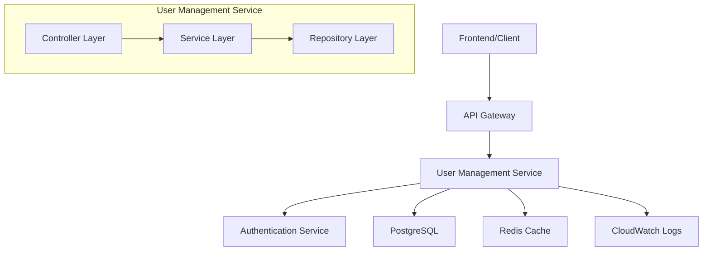

# 機能設計：ユーザー管理API

## 📋 基本情報
- **機能ID**：FEA-001
- **設計者**：バックエンドエンジニア 佐藤
- **レビュー担当**：テックリード 鈴木
- **作成日**：2024-01-10
- **最終更新**：2024-01-11
- **ステータス**：レビュー中

## 🎯 機能概要

### 機能説明
ユーザー情報の作成、取得、更新、削除を行うRESTful APIを提供する。認証されたユーザーのみがアクセス可能で、権限に応じて操作範囲を制限する。

### ビジネス価値
- 手動ユーザー管理から自動化への移行により、運用コストを60%削減
- データ整合性の向上により、ユーザー関連の障害を90%削減
- フロントエンド開発の基盤提供により、新機能の開発速度を2倍向上

### 対象ユーザー
- **システム管理者**：全ユーザーの管理・監視
- **一般ユーザー**：自身の情報の参照・更新
- **開発者**：API経由でのユーザー情報取得・操作

## 🏗️ アーキテクチャ設計

### システム構成図


### コンポーネント構成
| コンポーネント | 責務 | 技術スタック |
|---------------|------|-------------|
| API Gateway | ルーティング、レート制限、CORS | AWS API Gateway |
| Controller | HTTPリクエスト処理、バリデーション | FastAPI |
| Service | ビジネスロジック、認可処理 | Python 3.11 |
| Repository | データアクセス、クエリ実行 | SQLAlchemy |
| Database | データ永続化 | PostgreSQL 14 |
| Cache | セッション・クエリキャッシュ | Redis 7 |
| Monitoring | ログ集約、メトリクス収集 | CloudWatch |

## 🚀 API仕様

### エンドポイント一覧
| メソッド | エンドポイント | 説明 | 認証 |
|---------|---------------|------|------|
| GET | `/api/v1/users` | ユーザー一覧取得 | 要 |
| GET | `/api/v1/users/{id}` | ユーザー詳細取得 | 要 |
| POST | `/api/v1/users` | ユーザー作成 | 要 |
| PUT | `/api/v1/users/{id}` | ユーザー更新（全体） | 要 |
| PATCH | `/api/v1/users/{id}` | ユーザー更新（部分） | 要 |
| DELETE | `/api/v1/users/{id}` | ユーザー削除 | 要 |
| GET | `/api/v1/users/search` | ユーザー検索 | 要 |

### API詳細仕様

#### GET /api/v1/users
**概要**：ユーザー一覧をページネーション付きで取得

**リクエスト**
- **HTTPメソッド**：GET
- **URL**：`/api/v1/users`
- **認証**：Bearer Token

**クエリパラメータ**
| パラメータ | 型 | 必須 | 説明 | 例 |
|-----------|----|----|------|-----|
| page | integer | × | ページ番号（1から開始） | 1 |
| limit | integer | × | 取得件数（最大100） | 20 |
| sort | string | × | ソート条件 | "created_at:desc" |
| department | string | × | 部署フィルター | "開発部" |
| is_active | boolean | × | アクティブユーザーのみ | true |

**レスポンス**
```json
{
  "status": "success",
  "data": [
    {
      "id": 1,
      "name": "山田太郎",
      "email": "yamada@example.com",
      "age": 25,
      "department": "開発部",
      "role": "user",
      "is_active": true,
      "created_at": "2024-01-01T00:00:00Z",
      "updated_at": "2024-01-01T12:00:00Z"
    }
  ],
  "pagination": {
    "current_page": 1,
    "total_pages": 5,
    "total_count": 100,
    "per_page": 20,
    "has_next": true,
    "has_previous": false
  }
}
```

**エラーレスポンス**
```json
{
  "status": "error",
  "error": {
    "code": "UNAUTHORIZED",
    "message": "認証が必要です",
    "details": null
  }
}
```

#### POST /api/v1/users
**概要**：新規ユーザーを作成

**リクエスト**
- **HTTPメソッド**：POST
- **URL**：`/api/v1/users`
- **Content-Type**：`application/json`

**リクエストボディ**
```json
{
  "name": "山田太郎",
  "email": "yamada@example.com",
  "age": 25,
  "department": "開発部",
  "role": "user",
  "password": "SecurePassword123!"
}
```

**バリデーションルール**
| フィールド | ルール | エラーメッセージ |
|-----------|--------|-----------------|
| name | 必須、1-100文字、英数字・ひらがな・カタカナ・漢字のみ | "名前は1-100文字で入力してください" |
| email | 必須、メールアドレス形式、一意性制約 | "有効なメールアドレスを入力してください" |
| age | 任意、18-120の整数 | "年齢は18-120の整数で入力してください" |
| department | 任意、1-50文字 | "所属部署は50文字以内で入力してください" |
| role | 必須、admin/user/guestのいずれか | "権限を正しく選択してください" |
| password | 必須、8-100文字、英大小数字特殊文字含む | "パスワードは8文字以上で英数字記号を含めてください" |

**レスポンス（成功）**
```json
{
  "status": "success",
  "data": {
    "id": 123,
    "name": "山田太郎",
    "email": "yamada@example.com",
    "age": 25,
    "department": "開発部",
    "role": "user",
    "is_active": true,
    "created_at": "2024-01-10T10:00:00Z",
    "updated_at": "2024-01-10T10:00:00Z"
  }
}
```

#### DELETE /api/v1/users/{id}
**概要**：ユーザーを論理削除

**リクエスト**
- **HTTPメソッド**：DELETE
- **URL**：`/api/v1/users/{id}`
- **認証**：Bearer Token（admin権限必須）

**パスパラメータ**
| パラメータ | 型 | 説明 |
|-----------|----|----|
| id | integer | ユーザーID |

**レスポンス（成功）**
```json
{
  "status": "success",
  "message": "ユーザーが削除されました"
}
```

## 💾 データベース設計

### テーブル設計
#### users テーブル
| カラム名 | 型 | NULL | デフォルト | 説明 |
|---------|----|----|----------|------|
| id | SERIAL | NOT NULL | AUTO_INCREMENT | 主キー |
| name | VARCHAR(100) | NOT NULL | - | ユーザー名 |
| email | VARCHAR(255) | NOT NULL | - | メールアドレス |
| password_hash | VARCHAR(255) | NOT NULL | - | パスワードハッシュ |
| age | INTEGER | NULL | - | 年齢 |
| department | VARCHAR(50) | NULL | - | 所属部署 |
| role | VARCHAR(20) | NOT NULL | 'user' | 権限（admin/user/guest） |
| is_active | BOOLEAN | NOT NULL | true | アクティブフラグ |
| created_at | TIMESTAMP | NOT NULL | CURRENT_TIMESTAMP | 作成日時 |
| updated_at | TIMESTAMP | NOT NULL | CURRENT_TIMESTAMP | 更新日時 |
| deleted_at | TIMESTAMP | NULL | - | 削除日時（論理削除） |

### インデックス設計
| インデックス名 | カラム | 種類 | 用途 |
|---------------|--------|------|------|
| users_pkey | id | PRIMARY | 主キー |
| users_email_unique | email | UNIQUE | メールアドレス一意性 |
| idx_users_department | department | INDEX | 部署検索 |
| idx_users_created_at | created_at | INDEX | 日時ソート |
| idx_users_active | is_active, deleted_at | INDEX | アクティブユーザー検索 |

### 制約事項
- メールアドレスは全体で一意（削除ユーザー含む）
- 論理削除により物理削除は行わない
- role は列挙型で管理（admin, user, guest のみ）
- password_hash は bcrypt で暗号化

## 🔒 セキュリティ設計

### 認証・認可
- **認証方式**：JWT Bearer Token
- **権限レベル**：
  - `admin`: 全ユーザーの CRUD 操作
  - `user`: 自分の情報の参照・更新のみ
  - `guest`: 自分の情報の参照のみ
- **アクセス制御**：RBAC（Role-Based Access Control）

### 入力検証
- **SQLインジェクション対策**：SQLAlchemy ORM使用、パラメータ化クエリ
- **XSS対策**：入力値のHTMLエスケープ
- **CSRF対策**：SPA のため Synchronizer Token 不要

### データ保護
- **暗号化**：パスワードは bcrypt（cost=12）で暗号化
- **個人情報**：メールアドレス・名前のアクセスログ記録禁止
- **ログ管理**：機密情報のマスキング、30日間保存

## ⚡ パフォーマンス設計

### 性能要件
| 項目 | 要件 | 測定方法 |
|------|------|----------|
| レスポンス時間 | < 500ms（95%ile） | APM monitoring |
| スループット | > 100 req/sec | Load testing |
| 稼働率 | > 99.9% | Uptime monitoring |
| 同時接続数 | > 500 connections | Connection pool monitoring |

### 最適化戦略
- **キャッシュ戦略**：
  - Redis でユーザー情報キャッシュ（TTL: 30分）
  - 検索結果キャッシュ（TTL: 5分）
- **クエリ最適化**：
  - 複合インデックス活用
  - N+1問題対策（SELECT文最適化）
- **並行処理**：
  - 非同期処理（async/await）
  - コネクションプール（max: 20, min: 5）

## 🧪 テスト戦略

### テスト項目
#### 単体テスト
- [ ] UserService.create_user() - 正常系・異常系
- [ ] UserService.get_user_by_id() - 存在・非存在
- [ ] UserRepository.find_by_email() - メール検索
- [ ] 入力バリデーション - 全項目境界値テスト

#### 統合テスト
- [ ] POST /api/v1/users - ユーザー作成API
- [ ] GET /api/v1/users - 一覧取得・ページネーション
- [ ] DELETE /api/v1/users/{id} - 権限チェック
- [ ] 認証ミドルウェア動作確認

#### E2Eテスト
- [ ] ユーザー登録→ログイン→情報更新フロー
- [ ] 管理者によるユーザー管理フロー
- [ ] 権限エラーシナリオ

### テストデータ
```json
{
  "valid_user": {
    "name": "テスト太郎",
    "email": "test@example.com",
    "age": 25,
    "department": "開発部",
    "role": "user",
    "password": "TestPass123!"
  },
  "invalid_user": {
    "name": "",
    "email": "invalid-email",
    "age": 999,
    "role": "invalid_role",
    "password": "weak"
  },
  "admin_user": {
    "name": "管理者",
    "email": "admin@example.com",
    "role": "admin",
    "password": "AdminPass123!"
  }
}
```

## 📊 監視・運用

### 監視項目
- **システムメトリクス**：CPU使用率、メモリ使用率、ディスク容量
- **アプリケーションメトリクス**：
  - API レスポンス時間
  - エラー率（4xx, 5xx）
  - リクエスト数/秒
  - データベース接続数
- **ビジネスメトリクス**：
  - 新規ユーザー作成数
  - アクティブユーザー数
  - API 利用状況

### アラート設定
| 項目 | 閾値 | 通知先 |
|------|------|--------|
| レスポンス時間 | > 1秒（5分継続） | 開発チーム |
| エラー率 | > 5%（3分継続） | 開発チーム |
| CPU使用率 | > 80%（10分継続） | 運用チーム |
| データベース接続エラー | > 0件 | 開発・運用チーム |

### ログ仕様
```json
{
  "timestamp": "2024-01-10T10:00:00Z",
  "level": "INFO",
  "request_id": "req-123456",
  "user_id": 123,
  "method": "POST",
  "path": "/api/v1/users",
  "status_code": 201,
  "response_time": 245,
  "message": "User created successfully"
}
```

## 🔄 リリース計画

### フェーズ設計
#### Phase 1（MVP）- 2024/01/15
- [ ] 基本CRUD API実装
- [ ] JWT認証実装
- [ ] 基本バリデーション実装
- [ ] ユニットテスト実装

#### Phase 2（機能拡張）- 2024/01/30
- [ ] 検索・ソート機能
- [ ] ページネーション最適化
- [ ] Redis キャッシュ実装
- [ ] 統合テスト実装

#### Phase 3（最適化）- 2024/02/15
- [ ] パフォーマンス最適化
- [ ] 監視ダッシュボード構築
- [ ] セキュリティ強化
- [ ] E2Eテスト自動化

### ロールバック戦略
- **データベース**：Alembic マイグレーション（UP/DOWN）
- **アプリケーション**：Blue-Green デプロイメント
- **設定変更**：Git 管理による設定差分の巻き戻し
- **緊急時**：API Gateway でのトラフィック遮断

### デプロイメント手順
1. **ステージング環境デプロイ**
   - [ ] コード品質チェック（Ruff, Black, mypy）
   - [ ] 自動テスト実行（単体・統合・E2E）
   - [ ] セキュリティスキャン実行
   - [ ] パフォーマンステスト実行

2. **本番環境デプロイ**
   - [ ] メンテナンス通知
   - [ ] データベースマイグレーション
   - [ ] アプリケーションデプロイ
   - [ ] ヘルスチェック確認
   - [ ] 監視アラート有効化

---
**承認者**：テックリード 鈴木  
**承認日**：2024-01-12 